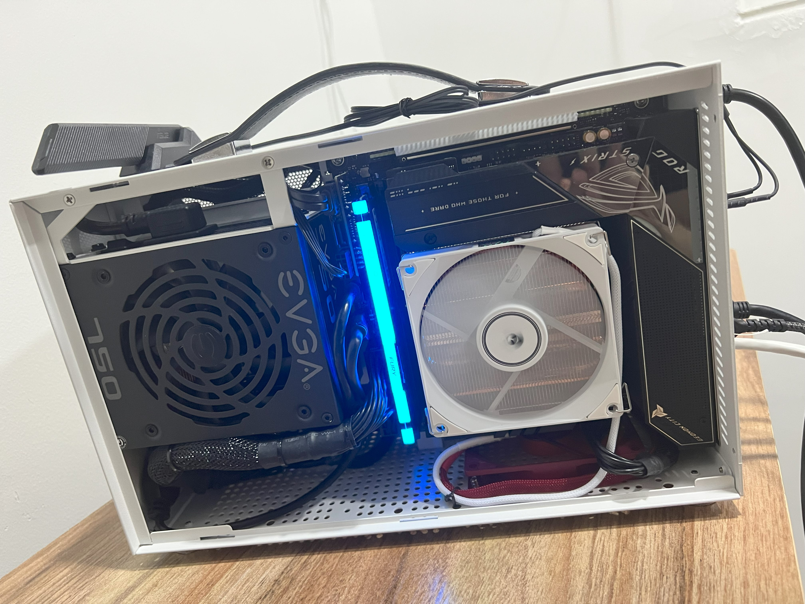
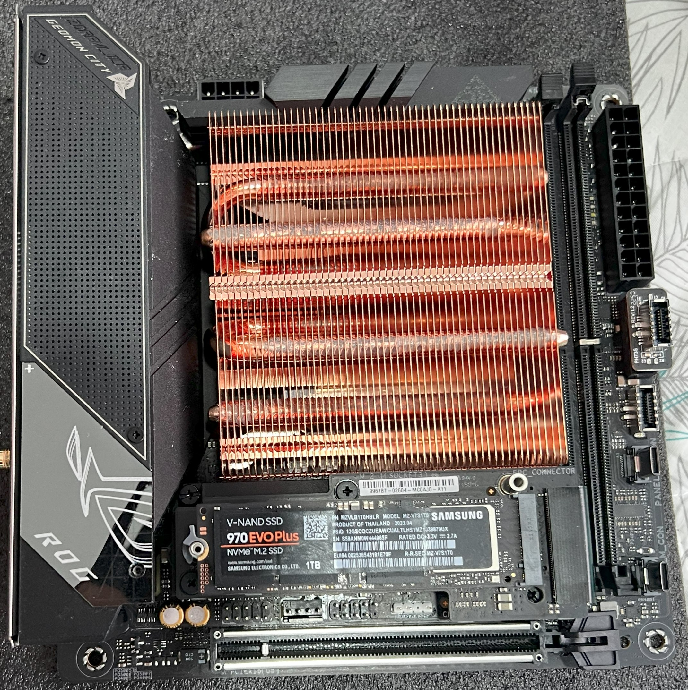
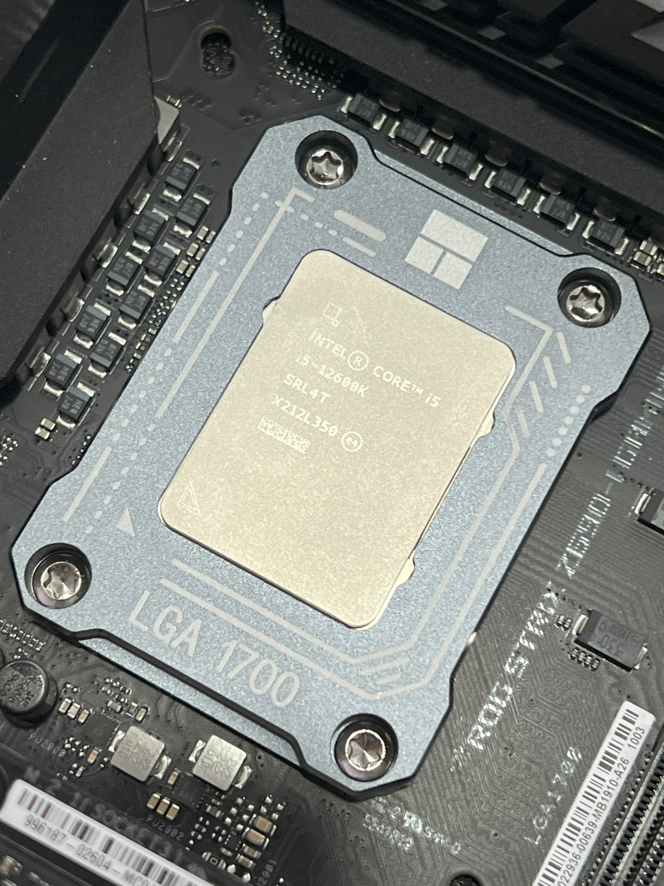
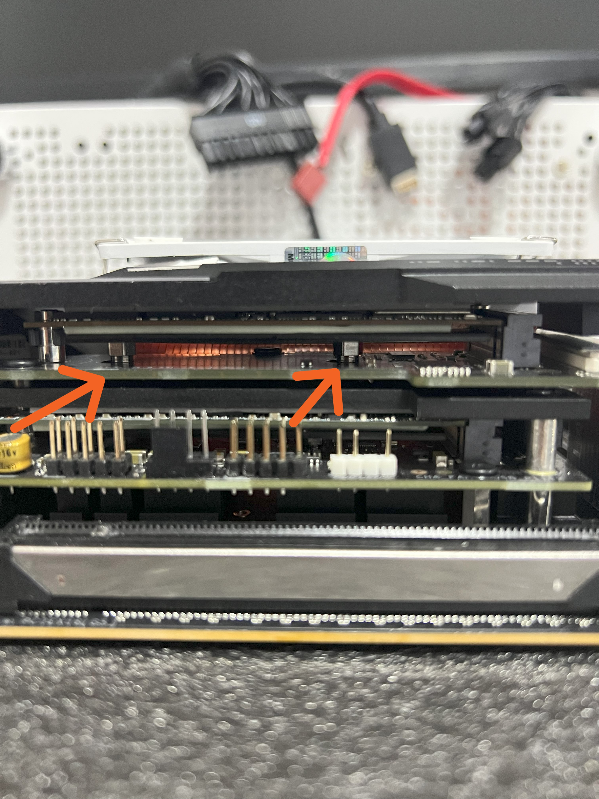

# PC Build 2023

# CPU

## Heat Sink 

Its important to install this particular heatsink correctly, the orientation should be with the air-outputs facing the M2 Slots, not the RAM slots.

## Contact Frame

This was a really good add-on

## Undervolt and Overclock (Asus BIOS)

Intel Core i5 12600K

|Core|Bios Value|Frecuency|
|-|-|-|
|P-Core 0|44|4400 MHz|
|P-Core 1|44|4400 MHz|
|P-Core 2|40|4000 MHz|
|P-Core 3|40|4000 MHz|
|P-Core 4|40|4000 MHz|
|P-Core 5|39|3900 MHz|
|E-Core 6|39|3900 MHz|
|E-Core 7|39|3900 MHz|
|E-Core 8|38|3800 MHz|
|E-Core 9|38|3800 MHz|

By doing this configuration, the P-Cores (Performance Cores) are really smart,taking values between 3.9 to 4.4 GHz; but at 100% usage, the clock goes at 3.9 GHz, and keeps good temperatures.

## RAM 

### Temperatures

Max: 64° (no matter if the case is opened or closed)

## M2 Slots and SSDs

For my case, I had to face few scenarios to get the best improvement possible. Such as:

1. Inverting the thermal pads from the default heatsinks.

    - This motherboard's M2 slots/heatsinks comes with particulary weird thermal pads, they are not the same size, and they are not the same type. So I had to invert them to get the best contact possible and it worked.
    - Specifically, the default config is a thermal pad that is kind-of green-ish and the other types us grey.
    The green-ish ones are thicker and they face the top part of the SSDs, while the grey ones are thinner and they face the bottom part of the SSDs.
    I don't know why I tried to invert them, but it worked perfectly.

    - Now the grey ones are facing the top part of the SSDs and the green-ish ones are facing the bottom part of the SSDs.

2. Uscrewing the (backplate or secondary) heatsink and attaching them directly to the SSDs directly.

    

### Samsung EVO 970+

We need to install the heatsink correctly to gain good temps
33°C-55°C (from HWinfo reports)

|Avg|Min|Max|
|-|-|-|
45°C|33°C|55°C|

### ADATA SX6000LP

Not as hot as the EVO 970+, but was a notory improvement when the backplate-heatsink was installed.

|Avg|Min|Max|
|-|-|-|
36°C|31°C|41°C|