# PC Build 2023

I started this build on September/2023, and I'm writing this on October/2023.

## CPU

LGA 1700, Intel Core i5 12600K 3.7 GHz

### Heat Sink

Its important to install this particular heatsink correctly, the orientation should be with the air-outputs facing the M2 Slots, not the RAM slots.

#### Backplate

I really gave my best to explain all this case, and also I wanted to build a good and long-term durable PC, so I was decided to make the best possible installation for the heatsink.

So, as you can see, this (AMD-MODE) should have been the common way to install the backplate:

But it didn't happen that way, because I had 2 issues:

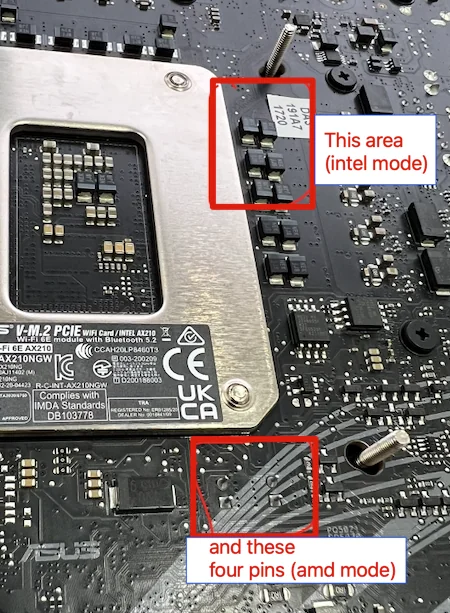

##### Intel Mode

This photo is not mine, but it shows the same issue I had with the backplate.
This is the author's photo: [Reddit Post](https://www.reddit.com/r/sffpc/comments/12154tu/asus_b660i_rog_strix_and_axp90_x47/) and Image showroom [Imgur](https://imgur.com/a/oA7gsD3)

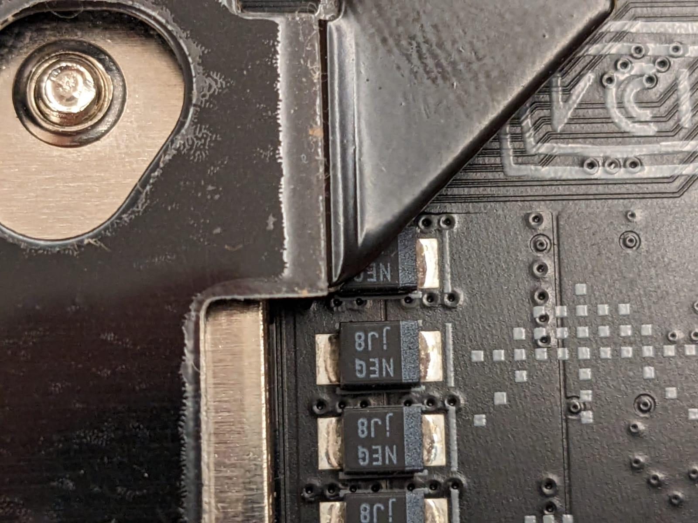

##### AMD Mode

This was a possible way to install, but I wasn't comfortable at all.

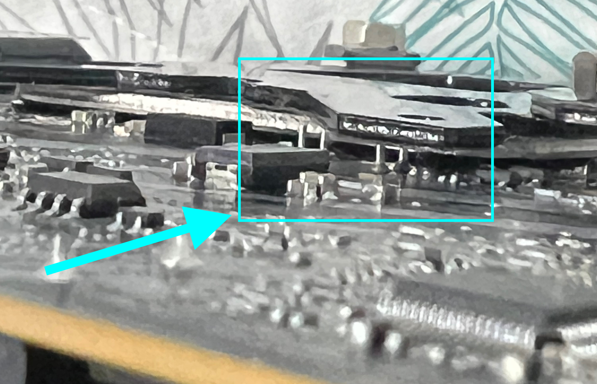

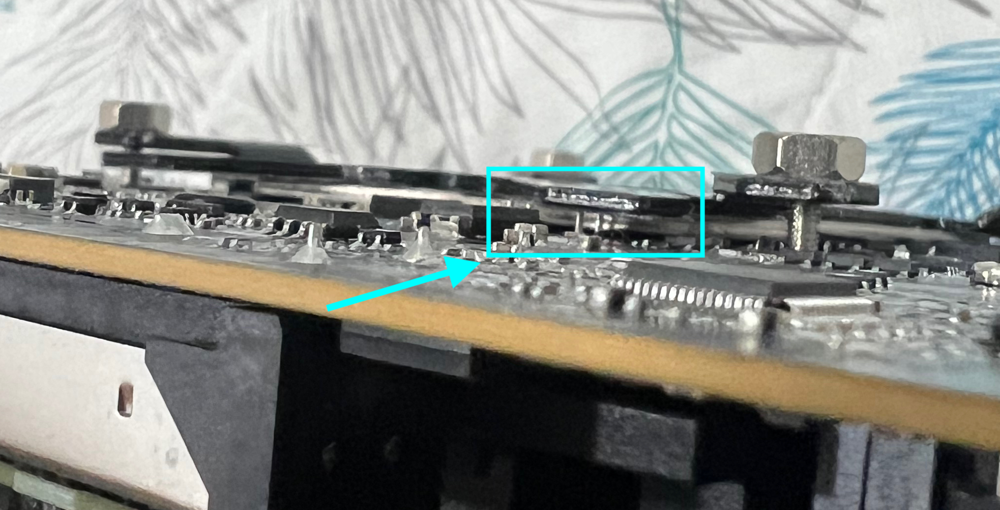

Between the backplate and those four pins, there is a really thin-plastic, that I think is an insulator.

I was thinking that at some point, the temperature would be too high and the backplate would melt that thin-plastic, and would cause a short-circuit.

##### Solution

So, I decided to install the backplate in a different way, using something that really impressed me.

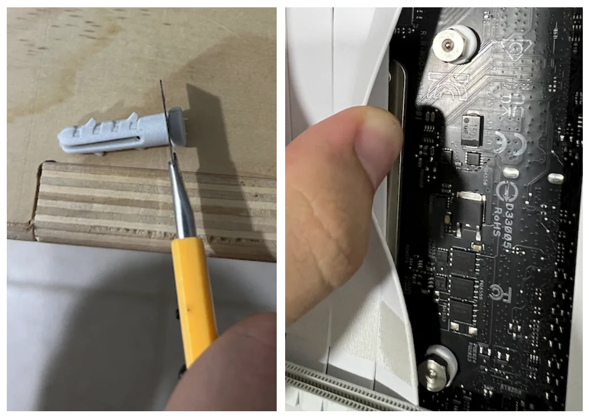

yep, I used a Wall Screw Plug, and it worked perfectly.

as an alternative that I took later, but I think is not necessary at all: **EK-AIO LGA1700 Upgrade Kit**, It would work and resist the same as the Wall Screw Plug.

## Contact Frame

This was a really good add-on

## Undervolt and Overclock (Asus BIOS)

Intel Core i5 12600K

|Core|Bios Value|Frecuency|
|-|-|-|
|P-Core 0|44|4400 MHz|
|P-Core 1|44|4400 MHz|
|P-Core 2|40|4000 MHz|
|P-Core 3|40|4000 MHz|
|P-Core 4|40|4000 MHz|
|P-Core 5|39|3900 MHz|
|E-Core 6|39|3900 MHz|
|E-Core 7|39|3900 MHz|
|E-Core 8|38|3800 MHz|
|E-Core 9|38|3800 MHz|

I think that the most important factors to reach this performance are:

- CPU System Agent Voltage: 1.18 V
- CPU Frecuencies: 3.8 to 4.4 GHz

By doing this configuration, the P-Cores (Performance Cores) are really smart, taking values between 3.9 to 4.4 GHz; but at 100% usage, the clock stickt at 3.9 GHz, and keeps good temperatures.

## RAM

### Temperatures

Max: 64° (no matter if the case is opened or closed)

## M2 Slots and SSDs

For my case, I had to face few scenarios to get the best improvement possible. Such as:

1. Inverting the thermal pads from the default heatsinks.

    - This motherboard's M2 slots/heatsinks comes with particulary weird thermal pads, they are not the same size, and they are not the same type. So I had to invert them to get the best contact possible and it worked.
    - Specifically, the **default** config is a thermal pad that is kind-of green-ish and the other types is grey.
    The green-ish ones are thicker and they face the top part of the SSDs, while the grey ones are thinner and they face the bottom part of the SSDs.
    I don't know why I tried to invert them, but it worked perfectly.

    - Now the grey ones are facing the top part of the SSDs and the green-ish ones are facing the bottom part of the SSDs.

    
    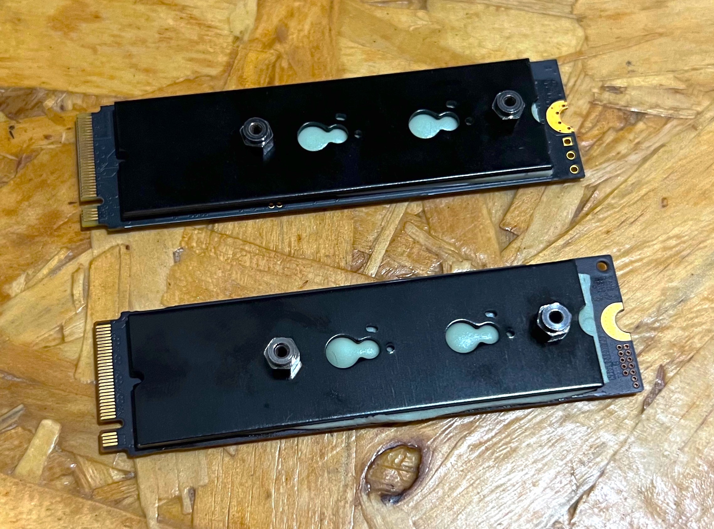
    

    - The back-heaksinks looks like this: (in my opinion, they are attached correctly and not moving at all)

    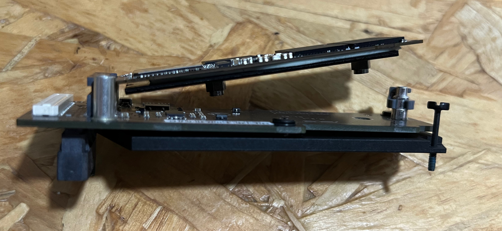
    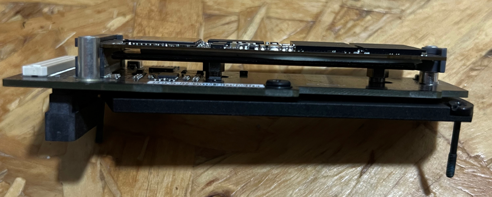
    

### Samsung EVO 970+

We need to install the heatsink correctly to gain good temps (by correctly, I mean, the air-outputs facing the M2 Slots, and with the thermal pads inverted).
33°C-55°C (from HWinfo reports)

|Avg|Min|Max|
|-|-|-|
45°C|33°C|55°C|

I don't remember the temps before the change, but I think it was around 55°C-68°C.

### ADATA SX6000LP

Not as hot as the EVO 970+, but was a notory improvement when the backplate-heatsink was installed.

|Avg|Min|Max|
|-|-|-|
36°C|31°C|41°C|

### M2 Ports

Top port:

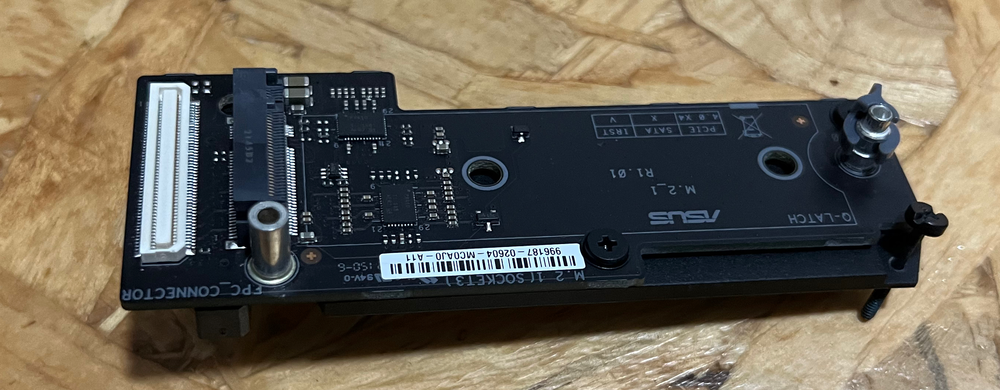

Bottom port:

Below the bottom port is the chipset heatsink:

## GPU

Not much to say, this ASUS RTX 4060 is a good deal, awesome performance and good temps.

## USB-e header, USB 20-pin header

In my opinion, these USB 20-pin headers are really a headache. I tried something new to replace it, and it worked.

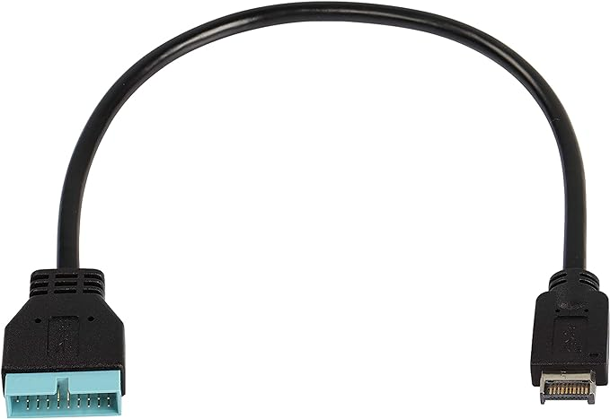
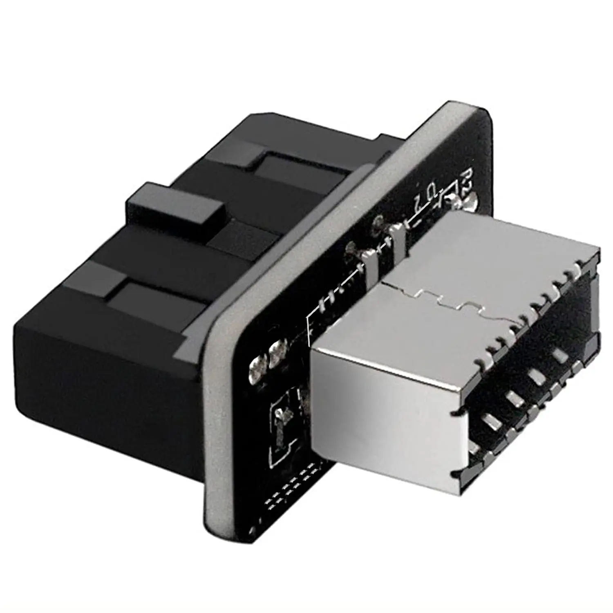
