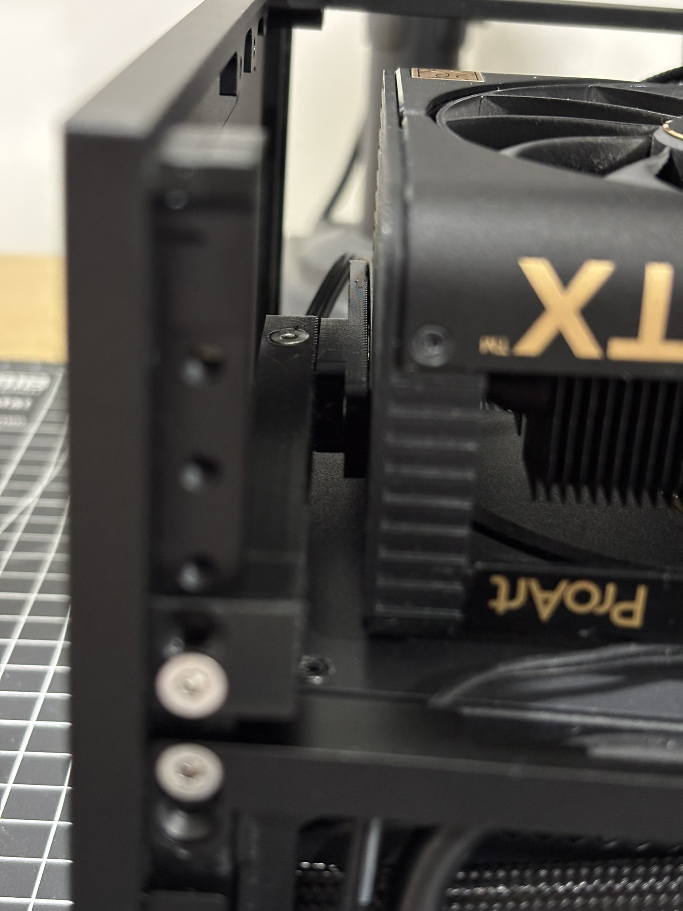

# PC Build: How Has It Performed So Far?

My previous build had a ROG-Z690-ITX motherboard, Intel setup, a single stick of RAM, among other details.  
At the end of 2024, I decided to upgrade to an AMD configuration, with a ROG B650Ei motherboard and a Ryzen 7 9700X.

| COMPONENT | DESCRIPTION |
| --- | --- |
| CPU | AMD Ryzen 7 9700X |
| GPU | NVIDIA RTX 4080 SUPER 16GB |
| RAM | Fury Beast 64GB (2x32GB) 6000MT/s DDR5 CL36 AMD Expo KF560C36BBEK2-64 |
| MOBO | ASUS ROG Strix B650E-I Gaming WiFi |
| SSD M.2 #1 | Samsung 990 Pro 4TB NVMe M.2 SSD |
| SSD M.2 #2 | Samsung 970 EVO Plus 1TB NVMe M.2 SSD |
| PSU | EVGA SFX SUPERNOVA 750W GM 80+ Gold |
| CASE | NCASE FORMD T1 V2.5 |
| COOLER | THERMALRIGHT AXP90-X53 LP FULL-COOPER (W/ STOCK FAN) |
| CASE FAN | Phanteks D30-120 DRGB PWM (x2) |

## Gallery

<!-- table of images -->
|  |  |
| --- | --- |
|  |  |
|  |  |
|  |  |

## Custom Cables

- 24-pin cable is a custom-made by myself, using default cable as reference. pins/connectors were bought from AliExpress.
- 8-pin CPU cable the same as the 24-pin.
- GPU 12VHPWR cable was purschased from dreambigbyray.com

## GPU Support for the RTX 4080 SUPER

GPU support bracket for the RTX 4080 SUPER, 3D printed (EIGA model: ...)

My goal with this bracket is to avoid any bending and/or sagging of the GPU. Before installing it, the GPU wasn't well supported and would visibly move depending on the case's position. I use the case on a mount under the desk, in a horizontal position, and noticed how the GPU's weight caused imbalance.

## M.2 SSDs Setup

This motherboard has 2 M.2 slots — one on the back and one on the front.

The rear M.2 is a Samsung 970 EVO Plus 1TB, and the front one is a Samsung 990 Pro 4TB.

For the rear M.2, when mounted directly in the back slot, temperatures were high — around 55-60°C under continuous use. Since this approaches the harmful temperature range (70°C), I decided to try an M.2 extension.

This greatly improved M.2 temps, as it’s now in an area with better airflow. It also enabled the possibility of using a heatsink for the M.2.

There were two options — use the screw hole provided by the case or 3M Velcro tape. I went with Velcro tape for now, pending further testing.

The reason I selected this specific M.2 Heatsink (Jeyi Godfins Gen1) is because it doesn't obstruct airflow for the CPU and GPU. It's the best fit for my case, I've tested a bunch of other heatsinks, and this one is the only one that fits well, disipates heat well, and doesn't obstruct airflow.

## Benchmarks / Performance Tests

My goal with this build — especially the CPU — is to maintain 5GHz on all cores, with good performance and temperatures.  
To achieve this, I used BIOS tweaks: PBO2, Curve Optimizer, and thermal limits.

I learned a lot from this video: https://www.youtube.com/watch?v=gyd7VDRApjM&t=35s

(BIOS screenshots coming soon...)

- For RAM, I’m currently running at 5600 MT/s, since using 6000 MT/s caused higher RAM stick temps without a noticeable performance gain.

