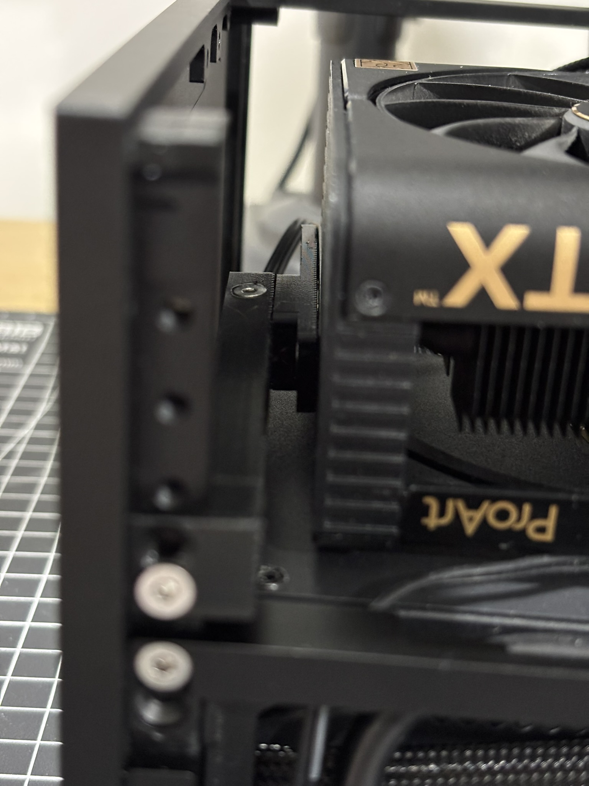
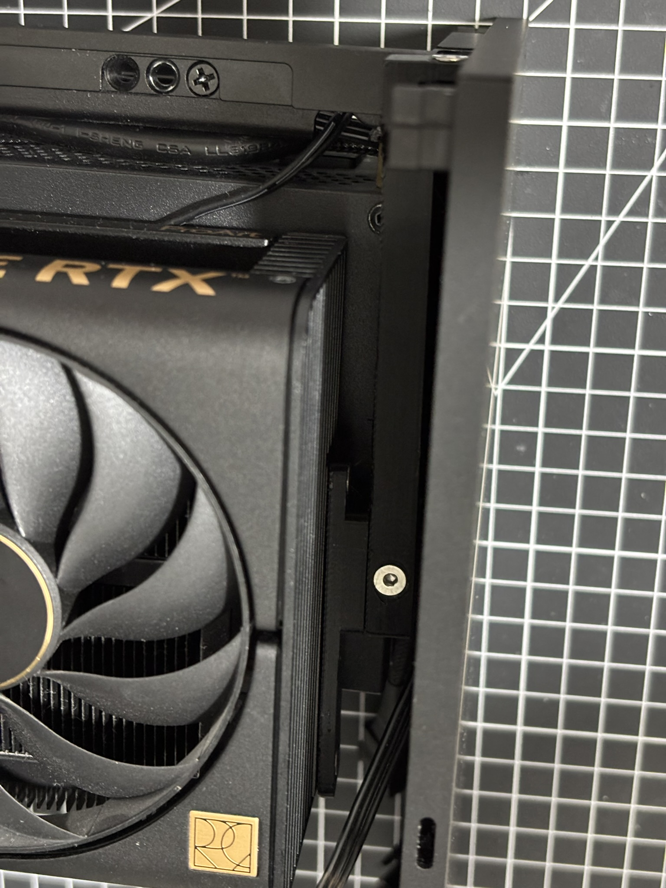
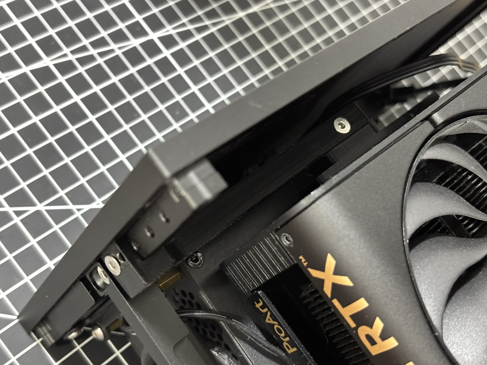
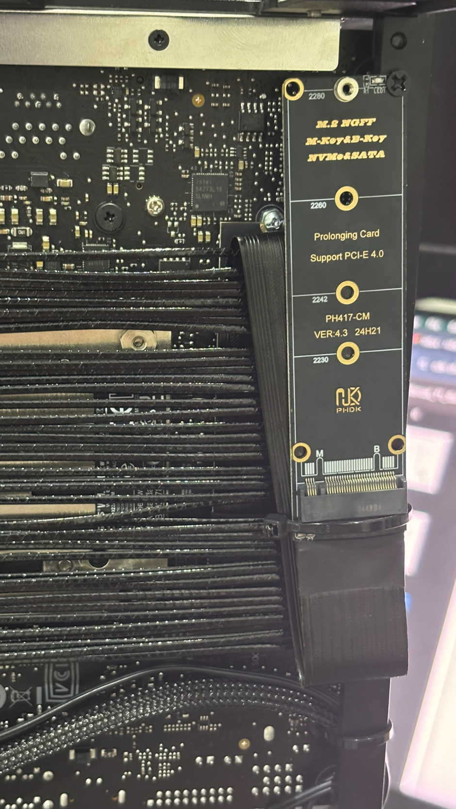
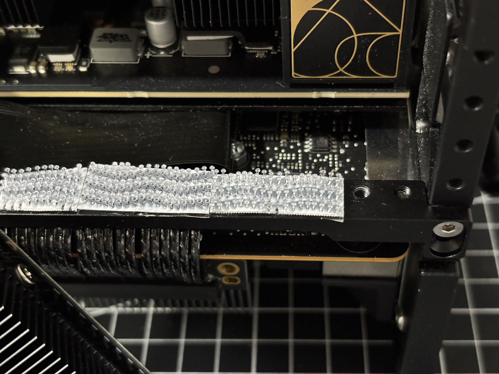
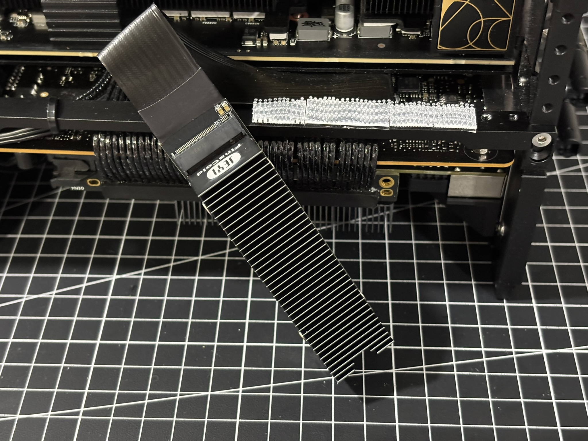
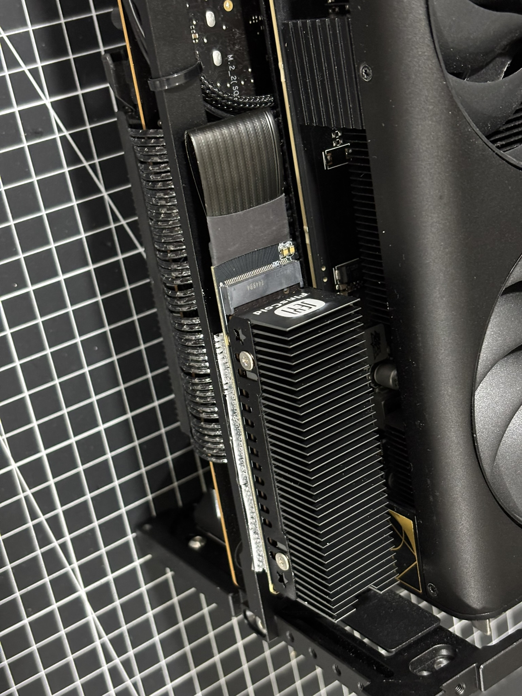

# PC Build: Como se ha comportado hasta ahora?

Mi build anterior tenía una MOBO rog-Z690-itx, configuración intel, un unico stick de ram de RAM, entre otros detalles.
A finales de 2024, decidí actualizar mi PC a una configuración AMD, con una MOBO ROG B650ei y un Ryzen 7 9700X.

<!-- quiero hacer una tabla con cada componente -->
| COMPONENTE | DESCRIPCIÓN |
| --- | --- |
| CPU | AMD Ryzen 7 9700X |
| GPU | NVIDIA RTX 4080 SUPER 16GB |
| RAM | Fury Beast 64GB (2x32GB) 6000MT/s DDR5 CL36 AMD Expo KF560C36BBEK2-64 |
| MOBO | ASUS ROG Strix B650E-I Gaming WiFi |
| SSD M.2 #1 | Samsung 990 Pro 4TB NVMe M.2 SSD |
| SSD M.2 #1 | Samsung 970 EVO Plus 1TB NVMe M.2 SSD |
| PSU | EVGA SFX SUPERNOVA 750W GM 80+ Gold |
| CASE | NCASE FORMD T1 V2.5 |
| COOLER | THERMALRIGHT AXP90-X53 LP FULL-COOPER (W/ STOCK FAN) |
| CASE FAN | Phanteks D30-120 DRGB PWM (x2) |

## Galeria 

## Soporte de GPU para la RTX 4080 SUPER

Soporte de GPU para la RTX 4080 SUPER, con impresion 3d (modelo de EIGA: ...)

## M.2 SSDs Configuración

Esto mejoró mucho las tempereaturas del M2, al estar en un area con mas flujo de aire.

Cinta Velcro de 3M, que uso para el M.2 trasero.

## Benchmarks/Pruebas de rendimiento

Mi meta con este build, en especifico con la CPU, era mantener los 5GHz multinucleo con buen rendimiento y temperaturas.

